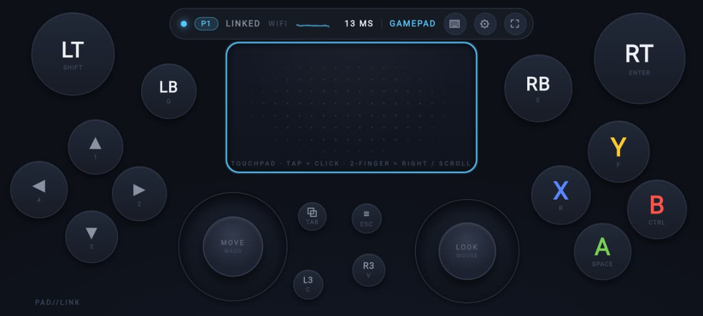
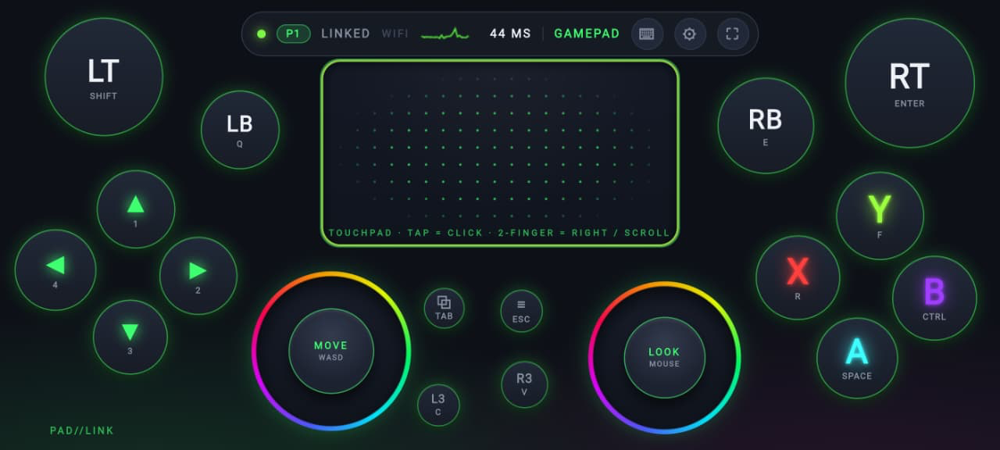
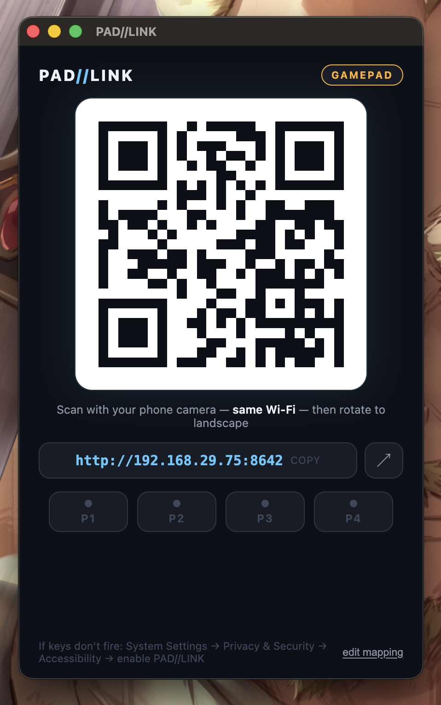

<div align="center">

# 🎮 PAD//LINK

**Turn your phone into a wireless gamepad for your Mac or Windows PC.**

No app install on the phone — scan a QR code and play. Up to 4 players.

[](https://github.com/PrajsRamteke/controller-pc/releases/latest)


<br>



<br><br>

 

<br>

*Midnight & RGB themes on the phone · the desktop app: scan → play*

<br>

🎬 **[▶ Watch the demo video](screenshots/demo.mp4)**

</div>

---

## ⬇️ Download

| Platform | Download | Notes |
|----------|----------|-------|
| 🍎 **macOS** (Apple Silicon) | [**PAD-LINK-1.0.0-mac.dmg**](https://github.com/PrajsRamteke/controller-pc/releases/latest/download/PAD-LINK-1.0.0-mac.dmg) | Drag to Applications |
| 🪟 **Windows** (installer) | [**PAD-LINK-Setup-1.0.0-win.exe**](https://github.com/PrajsRamteke/controller-pc/releases/latest/download/PAD-LINK-Setup-1.0.0-win.exe) | Recommended |
| 🪟 **Windows** (portable) | [**PAD-LINK-1.0.0-win-portable.exe**](https://github.com/PrajsRamteke/controller-pc/releases/latest/download/PAD-LINK-1.0.0-win-portable.exe) | No install, just run |

> All builds are also on the [**Releases page**](https://github.com/PrajsRamteke/controller-pc/releases).
> The apps are unsigned — see [first-launch notes](#%EF%B8%8F-first-launch-unsigned-app-notes) below.

## 🚀 Quick start (60 seconds)

1. **Download & open** the app for your computer (table above).
2. **Scan the QR code** shown in the app window with your phone
   (phone and computer on the same WiFi).
3. **Rotate to landscape, tap once** for fullscreen — you're playing. 🎉

The app window also shows the connection link (click to copy), a Wi-Fi / USB
endpoint switcher, and live **P1–P4** player slots.

### ⚠️ First launch (unsigned app notes)

- **macOS** — the app is unsigned, so the first launch needs
  **right-click → Open** (or `xattr -dr com.apple.quarantine "/Applications/PAD LINK.app"`).
  Then grant Accessibility permission to **PAD LINK**:
  *System Settings → Privacy & Security → Accessibility* — without this,
  macOS silently blocks the key presses.
- **Windows** — SmartScreen will warn on the unsigned installer: choose
  **More info → Run anyway**. If the firewall prompts, **allow on private
  networks**, otherwise the phone can't reach the app.

---

## ✨ What you get

- 🎮 **Xbox-style touch controller** — sticks, ABXY, triggers, D-pad, touchpad
- 👥 **4-player local multiplayer** — each phone gets its own color (P1–P4)
- 🖱️ **Swipe-to-look camera pad** with edge glide — way better than a fake right stick
- 📳 **Gyro aiming** — tilt the phone to aim (toggle in ⚙ settings)
- 🎨 **Theme skins** — Midnight, DualSense, Cyberpunk, Vaporwave, OLED Stealth, Retro CRT
- 🌈 **RGB lighting** — color-cycling glow around sticks and buttons, speed adjustable in ⚙ settings
- 💥 **Rumble** — game rumble vibrates the phone *and* ripples a shockwave across the pad
- 💾 **Profiles per game** — layout + button mapping saved, shareable via QR code
- ⌨️ **Keyboard passthrough** — type into the PC from your phone (chat, passwords)
- 📶 **Connection HUD** — live latency sparkline, packet-loss detection, auto-throttle
- 📲 **Install as an app (PWA)** — home-screen icon that auto-connects on launch
- 🔌 **USB wired mode** — ~1–5 ms latency over a cable

---

<details>
<summary><h3>🛠️ Run from source (instead of the desktop app)</h3></summary>

```bash
git clone https://github.com/PrajsRamteke/controller-pc.git
cd controller-pc
npm install
npm start
```

Scan the QR code printed in the terminal with your phone (same WiFi).

**macOS permission (one time):** the first time a key fires, macOS blocks it
silently unless your terminal has Accessibility access —
*System Settings → Privacy & Security → Accessibility* → enable **Terminal**
(or iTerm / VS Code, whichever runs the server). Restart the server after.

**Build the desktop apps yourself:**

```bash
npm run app        # run the Electron app unpackaged (dev)
npm run dist:mac   # → dist/PAD LINK-<version>-arm64.dmg
npm run dist:win   # → dist/PAD LINK Setup <version>.exe (+ portable exe)
```

The GitHub Actions workflow (`.github/workflows/build-apps.yml`) builds both
installers on real macOS/Windows runners — trigger it manually or push a
`v*` tag, then grab the artifacts.

</details>

<details>
<summary><h3>🕹️ Real gamepad mode — cloud gaming & browser games</h3></summary>

Browser games and cloud gaming sites (GeForce NOW, Xbox Cloud Gaming, etc. in
Chrome) detect controllers through the **Gamepad API**, not the keyboard. The
included browser extension makes PAD//LINK show up as a real standard-mapping
controller:

1. Chrome → `chrome://extensions` → enable **Developer mode**
2. **Load unpacked** → select the `extension/` folder in this repo
3. Start the server and connect your phone
4. Open https://hardwaretester.com/gamepad — **"PAD//LINK Wireless
   Controller"** appears, and cloud gaming sites show controller button prompts

While a tab with the extension is attached, the server **pauses
keyboard/mouse mapping** (the phone HUD shows `GAMEPAD` instead of `KEYS`) so
buttons don't double-fire as keystrokes. Close the tab and keyboard mode
resumes automatically. Game rumble is forwarded to the phone as vibration
(Android). With multiple phones connected, they show up as gamepads 0–3.

> **Note:** this covers anything running **in the browser**. Native apps
> (Steam games, the GeForce NOW app) can't see it — for those, keyboard mode
> below is the answer.

</details>

<details>
<summary><h3>⌨️ How input maps (keyboard mode)</h3></summary>

When no extension tab is attached, games see **keyboard + mouse**, which
nearly every game supports. Defaults — edit the mapping from the phone
(⚙ settings) or in `mapping.json`:

| Control      | Sends            |
|--------------|------------------|
| Left stick   | W / A / S / D    |
| Right stick  | Mouse look       |
| A            | Space (jump)     |
| B            | Ctrl (crouch)    |
| X / Y        | R / F            |
| LB / RB      | Q / E            |
| LT           | Shift (sprint)   |
| RT           | Enter            |
| D-pad        | 1 / 2 / 3 / 4    |
| View / Menu  | Tab / Esc        |
| Touchpad     | Mouse move · tap = click · 2-finger = right-click / scroll |

- Right stick can send arrow keys instead: set `rightStick.mode` to `"keys"`.
- Tune `sensitivity` (mouse speed) and `deadzone` in `mapping.json`.
- **Stick response curve** — the right stick sends `magnitude^curve` (expo),
  so the middle of the stick is fine-grained for aiming while full deflection
  keeps full speed. Tune it with the "Stick response" slider (1 = linear).
- In the desktop app, "edit mapping" in the window footer opens the mapping
  file (restart the app after editing).

</details>

<details>
<summary><h3>🔌 Wired connection (USB — lowest latency)</h3></summary>

The server watches for new network interfaces and prints a fresh QR when a
cable shows up; the phone HUD shows **USB** instead of WIFI when it's on the
wire (~1–5 ms instead of 10–30 ms). Pick whichever fits your phone:

- **iPhone**: plug into the Mac → enable **Personal Hotspot** → scan the new
  QR. Works out of the box.
- **Android 14+ (macOS 13+)**: plug in → Settings → Hotspot & tethering →
  **USB tethering** → scan the new QR.
- **Any Android with USB debugging**: just plug in — if `adb` is installed
  the server auto-creates a tunnel; open `http://localhost:8642` on the phone.

**Bluetooth fallback** (no WiFi around): pair the phone with the computer and
enable **Bluetooth tethering** on the phone — same URL trick. Note it's
*slower* than WiFi (~30–60 ms), so only use it when there's no network.

</details>

<details>
<summary><h3>📲 Install on the phone (home-screen app)</h3></summary>

Open the pad once in the browser, then **⚙ settings → Install app**.

- **Full install** (service worker + offline shell + real install prompt)
  needs a secure context. The USB adb tunnel gives you one for free —
  `http://localhost:8642` counts as secure — so install from there for the
  best result.
- **Over WiFi** (`http://192.168.x.x`) browsers treat the page as insecure,
  so the button shows the manual path instead: browser menu →
  **Add to Home Screen** (iPhone: Share → Add to Home Screen). You still get
  the icon, fullscreen launch, and auto-connect — just no offline cache.
  Optional Chrome-on-Android workaround: `chrome://flags` →
  "Insecure origins treated as secure" → add `http://<computer-ip>:8642`.

Either way, tapping the icon launches straight into the controller and it
links up on its own — the pad remembers every address it has ever reached the
server on and cycles through them until one answers, so it survives IP
changes. No QR re-scan needed.

</details>

<details>
<summary><h3>📡 Latency & tips</h3></summary>

Expect **~10–30 ms** on a decent WiFi network (**~1–5 ms** wired) — the HUD
shows live round-trip latency plus a sparkline of the last 30 seconds.

- Keep phone and computer on the same **5 GHz** band for best feel.
- The touchpad light bar pulses **amber** when the connection is struggling;
  stick updates auto-throttle on weak WiFi.
- On connect, a console-style boot-up light wave sweeps across the controls
  and the light bar breathes into your player color. Losing the link plays
  the reverse sweep in red.

</details>

<details>
<summary><h3>⚠️ Honest limitations</h3></summary>

- Gamepad mode only works **inside the browser** (via the extension). Native
  apps see keyboard emulation — no analog triggers, and native games that
  *require* a controller won't work (macOS has no userspace virtual-HID API).
- iOS Safari doesn't support `navigator.vibrate`, so haptics are Android-only.
- Fullscreen/orientation lock behaves best in Chrome on Android; on iOS add
  the pad to the home screen for a chromeless experience.
- RT as a fire button: most shooters fire on mouse click — wiring
  RT → left click is a 3-line change in `server.js` if you want it (ping me).

</details>

---

<div align="center">

**Made with ❤️ — scan, rotate, play.**

</div>
